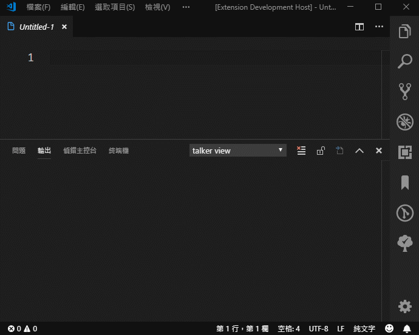
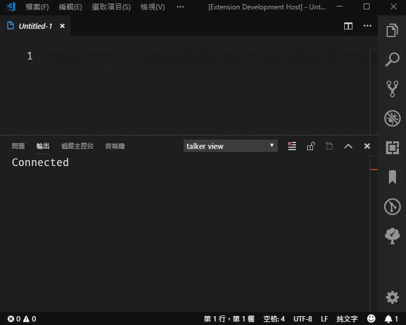
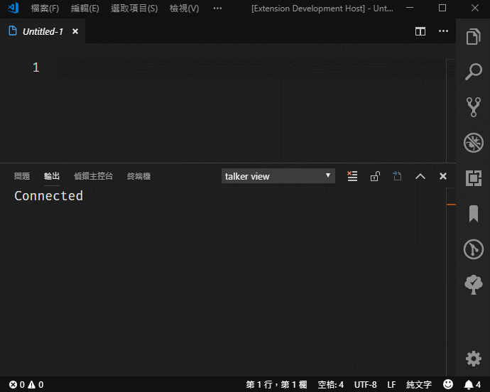
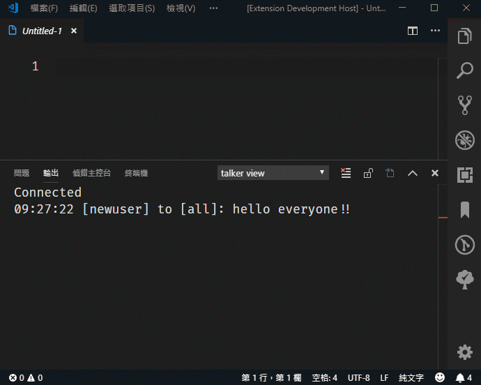
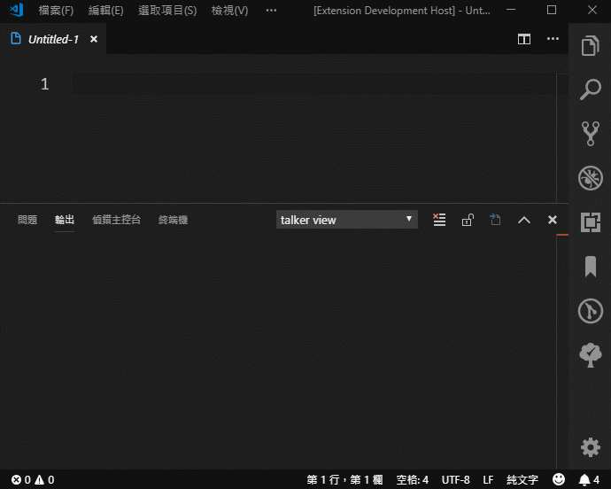

# teamtalker README

This is the README for extension "teamtalker".

## Features

### Commands

| command |
| ----    |
| connect |
| join |
| login |
| toall |
| to |
| list |

1. ***connect***

    Establish a connection between vscode & server.
    Input format like `ip`**:**`port`

    ** You have to **connect** to server before executing any other commands.

    

2. ***join***

    Join conversations as an Anonymous.

    Session timeout is **1 hour**. If timeout, you have to re-join.

    ** You have to do **connect** first.

    

3. ***login***

    Join conversations by login.

    If you are using a known user id => login

    If you input a user id not existed => create & login

    Session timeout is **1 hour**. If timeout, you have to re-login.

    ** You have to do **connect** first.

    

4. ***toall***

    Send a message to all connected to server.

    ** You have to do **join** or **login** before doing this.

    

5. ***to***

    Send a message to a existed user.

    ** You have to do **join** or **login** before doing this.

    

6. ***list***

    List all users.

    ** You have to do **connect** first.

    

## Known Issues

Glad to catch your issue.

**Enjoy!**
